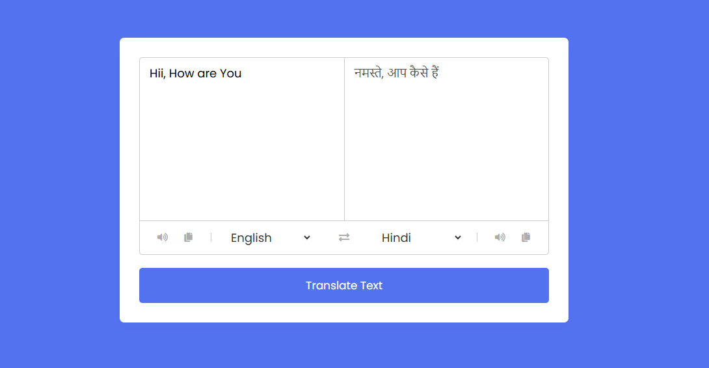

# 🌐 Language Translator

A simple and interactive web app that translates text between languages using the **MyMemory Translation API**. Users can listen to text, copy it, and swap languages easily. This is a great beginner-friendly JavaScript project with real-world use cases.

---

## 🚀 Features

- 🔄 Translate between 100+ languages using [MyMemory API](https://mymemory.translated.net/)
- 🎤 Speech synthesis: Listen to both input and translated text
- 📋 Copy functionality for both input and output fields
- 🔁 One-click swap for source and target languages
- 🌐 Fully responsive and clean UI

---

## 💻 Live Demo

👉 [Click here to try it out!](https://language-translator-faczwj8ry-ashishs-projects-1448cb93.vercel.app)

---

## 🧪 How It Works

- The app uses `fetch()` to call the MyMemory Translation API:
